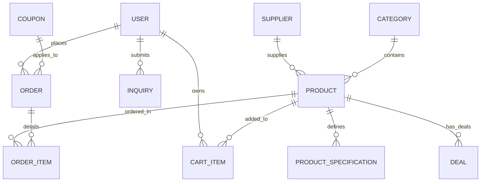

# Unified E-Commerce Backend Architecture (Identity, SQLite, & JWT Integration)

This comprehensive guide details the complete database entity models and backend security configuration for the Alibaba-style E-commerce platform. It captures all functional elements of the frontend layout—including **landing page deals**, **regional suppliers**, **buyer inquiries**, **advanced catalog filtering**, **cart actions**, and **admin CRUD tracking**.

---

## 1. Complete Project Analysis & Entity Mapping

A thorough audit of the React client pages establishes the following database mapping requirements:
*   **Landing Page (`MainBody.jsx`)**: Needs models for countdown flash deals (`Deals`), custom categories (`Categories`), service modules (`Services`), regional suppliers (`Suppliers`), catalog inquiry forms (`Inquiries`), and email signups (`NewsletterSubscriptions`).
*   **Product Catalog (`ProductList.jsx` / `ProductDetails.jsx`)**: Needs robust specs mapping (`ProductSpecifications`), product fields supporting discount margins (`Price` / `OldPrice`), delivery variables (`FreeShipping`), ratings, and verified merchant relations.
*   **Order Operations (`Cart.jsx`)**: Requires detailed cart representations (`CartItems`) supporting quantities and "Saved for later" parameters, promo keys (`Coupons`), and double-entry order summaries (`Orders` and `OrderItems`).
*   **Admin Center (`AdminProducts.jsx`)**: Demands dynamic dashboard updates, authorization boundaries (`IdentityUser` roles), and product table CRUD synchronizations.

### Entity Relationship Diagram


---

## 2. NuGet Packages Required
Run the following commands to install core providers for SQLite, Identity mapping, and JWT authorization in your ASP.NET Core Web API:
```bash
dotnet add package Microsoft.EntityFrameworkCore.Sqlite
dotnet add package Microsoft.EntityFrameworkCore.Design
dotnet add package Microsoft.AspNetCore.Identity.EntityFrameworkCore
dotnet add package Microsoft.AspNetCore.Authentication.JwtBearer
dotnet add package System.IdentityModel.Tokens.Jwt
```

---

## 3. Database Entity Models

### A. Authentication & User Entity
```csharp
using Microsoft.AspNetCore.Identity;
using System.ComponentModel.DataAnnotations;

namespace EcommerceBackend.Entities
{
    public class User : IdentityUser<Guid>
    {
        [Required]
        [MaxLength(100)]
        public string FullName { get; set; } = string.Empty;

        public DateTime CreatedAt { get; set; } = DateTime.UtcNow;

        // Navigation Properties
        public ICollection<CartItem> CartItems { get; set; } = new List<CartItem>();
        public ICollection<Order> Orders { get; set; } = new List<Order>();
        public ICollection<Inquiry> Inquiries { get; set; } = new List<Inquiry>();
    }
}
```

### B. Catalog & Vendor Entities
```csharp
using System.ComponentModel.DataAnnotations;
using System.ComponentModel.DataAnnotations.Schema;

namespace EcommerceBackend.Entities
{
    public class Category
    {
        [Key]
        public int Id { get; set; }

        [Required]
        [MaxLength(100)]
        public string Name { get; set; } = string.Empty;

        [MaxLength(500)]
        public string Description { get; set; } = string.Empty;

        public int? ParentCategoryId { get; set; }
        public Category? ParentCategory { get; set; }

        public ICollection<Category> SubCategories { get; set; } = new List<Category>();
        public ICollection<Product> Products { get; set; } = new List<Product>();
    }

    public class Supplier
    {
        [Key]
        public Guid Id { get; set; }

        [Required]
        [MaxLength(150)]
        public string CompanyName { get; set; } = string.Empty;

        [Required]
        [MaxLength(100)]
        public string Country { get; set; } = string.Empty;

        [Required]
        [MaxLength(100)]
        public string City { get; set; } = string.Empty;

        public bool IsVerified { get; set; } = false;
        public bool WorldwideShipping { get; set; } = true;
        public DateTime JoinedAt { get; set; } = DateTime.UtcNow;

        public ICollection<Product> Products { get; set; } = new List<Product>();
    }

    public class Product
    {
        [Key]
        public Guid Id { get; set; }

        [Required]
        [MaxLength(250)]
        public string Title { get; set; } = string.Empty;

        [Required]
        public string Description { get; set; } = string.Empty;

        [Required]
        [Column(TypeName = "decimal(18,2)")]
        public decimal Price { get; set; }

        [Column(TypeName = "decimal(18,2)")]
        public decimal? OldPrice { get; set; }

        public string? ImageUrl { get; set; }
        public List<string> ThumbnailUrls { get; set; } = new List<string>();

        public double Rating { get; set; } = 0.0;
        public int RatingCount { get; set; } = 0;
        public int TotalOrders { get; set; } = 0;
        public bool FreeShipping { get; set; } = false;
        public int StockQuantity { get; set; } = 0;
        public bool IsNegotiable { get; set; } = false;

        [MaxLength(100)]
        public string Warranty { get; set; } = "No Warranty";

        // Foreign Keys
        public int CategoryId { get; set; }
        public Category Category { get; set; } = null!;

        public Guid SupplierId { get; set; }
        public Supplier Supplier { get; set; } = null!;

        public ICollection<ProductSpecification> Specifications { get; set; } = new List<ProductSpecification>();
        public ICollection<Deal> Deals { get; set; } = new List<Deal>();
    }

    public class ProductSpecification
    {
        [Key]
        public int Id { get; set; }

        [Required]
        [MaxLength(100)]
        public string Name { get; set; } = string.Empty; // e.g. "Model", "Memory", "Size"

        [Required]
        [MaxLength(250)]
        public string Value { get; set; } = string.Empty; // e.g. "36GB RAM", "ISO-8989"

        public Guid ProductId { get; set; }
        public Product Product { get; set; } = null!;
    }
}
```

### C. Landing Page Custom Entities
```csharp
using System.ComponentModel.DataAnnotations;
using System.ComponentModel.DataAnnotations.Schema;

namespace EcommerceBackend.Entities
{
    public class Deal
    {
        [Key]
        public int Id { get; set; }

        [Required]
        [Column(TypeName = "decimal(5,2)")]
        public decimal DiscountPercent { get; set; } // e.g. 25.00 for -25%

        [Required]
        public DateTime EndDate { get; set; } // For countdown timer

        public Guid ProductId { get; set; }
        public Product Product { get; set; } = null!;
    }

    public class Inquiry
    {
        [Key]
        public Guid Id { get; set; }

        [Required]
        [MaxLength(150)]
        public string ItemName { get; set; } = string.Empty; // "What item you need?"

        [Required]
        public string Details { get; set; } = string.Empty; // "Type more details"

        [Required]
        public int Quantity { get; set; }

        [Required]
        [MaxLength(20)]
        public string Unit { get; set; } = "Pcs"; // "Pcs", "Kg"

        public DateTime CreatedAt { get; set; } = DateTime.UtcNow;

        public Guid? UserId { get; set; }
        public User? User { get; set; }
    }

    public class Service
    {
        [Key]
        public int Id { get; set; }

        [Required]
        [MaxLength(150)]
        public string Title { get; set; } = string.Empty;

        [Required]
        [MaxLength(100)]
        public string IconName { get; set; } = string.Empty; // Lucide icon lookup code

        [Required]
        public string ImageUrl { get; set; } = string.Empty;
    }

    public class NewsletterSubscription
    {
        [Key]
        public int Id { get; set; }

        [Required]
        [EmailAddress]
        [MaxLength(256)]
        public string Email { get; set; } = string.Empty;

        public DateTime SubscribedAt { get; set; } = DateTime.UtcNow;
    }
}
```

### D. Cart, Coupons & Order Entities
```csharp
using System.ComponentModel.DataAnnotations;
using System.ComponentModel.DataAnnotations.Schema;

namespace EcommerceBackend.Entities
{
    public class CartItem
    {
        [Key]
        public int Id { get; set; }

        public Guid UserId { get; set; }
        public User User { get; set; } = null!;

        public Guid ProductId { get; set; }
        public Product Product { get; set; } = null!;

        public int Quantity { get; set; } = 1;

        [MaxLength(50)]
        public string? Size { get; set; }

        [MaxLength(50)]
        public string? Color { get; set; }

        [MaxLength(100)]
        public string? Material { get; set; }

        public DateTime DateAdded { get; set; } = DateTime.UtcNow;
        public bool IsSavedForLater { get; set; } = false; // Cart vs Saved list support
    }

    public class Coupon
    {
        [Key]
        public int Id { get; set; }

        [Required]
        [MaxLength(50)]
        public string Code { get; set; } = string.Empty; // e.g. "ALIBABA"

        [Required]
        [Column(TypeName = "decimal(5,2)")]
        public decimal DiscountPercent { get; set; } // 0.15 for 15%

        public DateTime ExpiryDate { get; set; }
        public bool IsActive { get; set; } = true;
    }

    public class Order
    {
        [Key]
        public Guid Id { get; set; }

        public Guid UserId { get; set; }
        public User User { get; set; } = null!;

        public DateTime OrderDate { get; set; } = DateTime.UtcNow;

        [Required]
        [Column(TypeName = "decimal(18,2)")]
        public decimal Subtotal { get; set; }

        [Column(TypeName = "decimal(18,2)")]
        public decimal DiscountAmount { get; set; } = 0.00m;

        [Column(TypeName = "decimal(18,2)")]
        public decimal Tax { get; set; } = 14.00m;

        [Required]
        [Column(TypeName = "decimal(18,2)")]
        public decimal Total { get; set; }

        [Required]
        [MaxLength(50)]
        public string Status { get; set; } = "Pending"; // Pending, Shipped, Delivered, Cancelled

        [Required]
        [MaxLength(500)]
        public string ShippingAddress { get; set; } = string.Empty;

        public int? CouponId { get; set; }
        public Coupon? Coupon { get; set; }

        public ICollection<OrderItem> OrderItems { get; set; } = new List<OrderItem>();
    }

    public class OrderItem
    {
        [Key]
        public int Id { get; set; }

        public Guid OrderId { get; set; }
        public Order Order { get; set; } = null!;

        public Guid ProductId { get; set; }
        public Product Product { get; set; } = null!;

        [Required]
        [Column(TypeName = "decimal(18,2)")]
        public decimal UnitPrice { get; set; }

        public int Quantity { get; set; }

        [MaxLength(50)]
        public string? Size { get; set; }

        [MaxLength(50)]
        public string? Color { get; set; }

        [MaxLength(100)]
        public string? Material { get; set; }
    }
}
```

---

## 4. Application DbContext

### `ApplicationDbContext.cs`
```csharp
using EcommerceBackend.Entities;
using Microsoft.AspNetCore.Identity;
using Microsoft.AspNetCore.Identity.EntityFrameworkCore;
using Microsoft.EntityFrameworkCore;

namespace EcommerceBackend.Data
{
    public class ApplicationDbContext : IdentityDbContext<User, IdentityRole<Guid>, Guid>
    {
        public ApplicationDbContext(DbContextOptions<ApplicationDbContext> options)
            : base(options)
        {
        }

        public DbSet<Category> Categories { get; set; }
        public DbSet<Supplier> Suppliers { get; set; }
        public DbSet<Product> Products { get; set; }
        public DbSet<ProductSpecification> ProductSpecifications { get; set; }
        public DbSet<Deal> Deals { get; set; }
        public DbSet<Inquiry> Inquiries { get; set; }
        public DbSet<Service> Services { get; set; }
        public DbSet<NewsletterSubscription> NewsletterSubscriptions { get; set; }
        public DbSet<CartItem> CartItems { get; set; }
        public DbSet<Coupon> Coupons { get; set; }
        public DbSet<Order> Orders { get; set; }
        public DbSet<OrderItem> OrderItems { get; set; }

        protected override void OnModelCreating(ModelBuilder modelBuilder)
        {
            base.OnModelCreating(modelBuilder);

            // Configure Unique constraint for Coupon Code
            modelBuilder.Entity<Coupon>()
                .HasIndex(c => c.Code)
                .IsUnique();

            // Self-referencing relationship for Category Hierarchy
            modelBuilder.Entity<Category>()
                .HasOne(c => c.ParentCategory)
                .WithMany(c => c.SubCategories)
                .HasForeignKey(c => c.ParentCategoryId)
                .OnDelete(DeleteBehavior.Restrict);

            // Configure Restrict Deletes to prevent circular cascading loops
            modelBuilder.Entity<Product>()
                .HasOne(p => p.Category)
                .WithMany(c => c.Products)
                .HasForeignKey(p => p.CategoryId)
                .OnDelete(DeleteBehavior.Restrict);

            modelBuilder.Entity<Product>()
                .HasOne(p => p.Supplier)
                .WithMany(s => s.Products)
                .HasForeignKey(p => p.SupplierId)
                .OnDelete(DeleteBehavior.Restrict);

            modelBuilder.Entity<OrderItem>()
                .HasOne(oi => oi.Order)
                .WithMany(o => o.OrderItems)
                .HasForeignKey(oi => oi.OrderId)
                .OnDelete(DeleteBehavior.Cascade);

            modelBuilder.Entity<CartItem>()
                .HasOne(ci => ci.User)
                .WithMany(u => u.CartItems)
                .HasForeignKey(ci => ci.UserId)
                .OnDelete(DeleteBehavior.Cascade);

            modelBuilder.Entity<Deal>()
                .HasOne(d => d.Product)
                .WithMany(p => p.Deals)
                .HasForeignKey(d => d.ProductId)
                .OnDelete(DeleteBehavior.Cascade);
        }
    }
}
```

---

## 5. Web API Architecture Config (`appsettings.json` & `Program.cs`)

### `appsettings.json`
```json
{
  "ConnectionStrings": {
    "DefaultConnection": "Data Source=ecommerce.db"
  },
  "JwtSettings": {
    "SecretKey": "SuperSecretSuperLongKeyThatIsAtLeast256BitsLong!!",
    "Issuer": "EcommerceBackendApi",
    "Audience": "EcommerceFrontend",
    "DurationInMinutes": 60
  },
  "Logging": {
    "LogLevel": {
      "Default": "Information",
      "Microsoft.AspNetCore": "Warning"
    }
  },
  "AllowedHosts": "*"
}
```

### `Program.cs`
```csharp
using System.Text;
using EcommerceBackend.Data;
using EcommerceBackend.Entities;
using Microsoft.AspNetCore.Authentication.JwtBearer;
using Microsoft.AspNetCore.Identity;
using Microsoft.EntityFrameworkCore;
using Microsoft.IdentityModel.Tokens;

var builder = WebApplication.CreateBuilder(args);

// 1. Configure SQLite Engine
builder.Services.AddDbContext<ApplicationDbContext>(options =>
    options.UseSqlite(builder.Configuration.GetConnectionString("DefaultConnection")));

// 2. Configure ASP.NET Core Identity with customizable password policies
builder.Services.AddIdentity<User, IdentityRole<Guid>>(options =>
{
    options.Password.RequireDigit = true;
    options.Password.RequireLowercase = true;
    options.Password.RequireUppercase = true;
    options.Password.RequireNonAlphanumeric = true;
    options.Password.RequiredLength = 8;
    options.User.RequireUniqueEmail = true;
})
.AddEntityFrameworkStores<ApplicationDbContext>()
.AddDefaultTokenProviders();

// 3. Configure JWT Authentication Parameters
var jwtSettings = builder.Configuration.GetSection("JwtSettings");
var secretKey = Encoding.UTF8.GetBytes(jwtSettings["SecretKey"]!);

builder.Services.AddAuthentication(options =>
{
    options.DefaultAuthenticateScheme = JwtBearerDefaults.AuthenticationScheme;
    options.DefaultChallengeScheme = JwtBearerDefaults.AuthenticationScheme;
})
.AddJwtBearer(options =>
{
    options.TokenValidationParameters = new TokenValidationParameters
    {
        ValidateIssuer = true,
        ValidateAudience = true,
        ValidateLifetime = true,
        ValidateIssuerSigningKey = true,
        ValidIssuer = jwtSettings["Issuer"],
        ValidAudience = jwtSettings["Audience"],
        IssuerSigningKey = new SymmetricSecurityKey(secretKey),
        ClockSkew = TimeSpan.Zero
    };
});

builder.Services.AddControllers();
builder.Services.AddEndpointsApiExplorer();
builder.Services.AddSwaggerGen();

var app = builder.Build();

if (app.Environment.IsDevelopment())
{
    app.UseSwagger();
    app.UseSwaggerUI();
}

app.UseHttpsRedirection();

// 4. Activate Authentication / Authorization Pipelines
app.UseAuthentication();
app.UseAuthorization();

app.MapControllers();

app.Run();
```

---

## 6. Secure Authentication Controller (`AuthController.cs`)

```csharp
using System.IdentityModel.Tokens.Jwt;
using System.Security.Claims;
using System.Text;
using EcommerceBackend.Entities;
using Microsoft.AspNetCore.Identity;
using Microsoft.AspNetCore.Mvc;
using Microsoft.IdentityModel.Tokens;

namespace EcommerceBackend.Controllers
{
    [ApiController]
    [Route("api/[controller]")]
    public class AuthController : ControllerBase
    {
        private readonly UserManager<User> _userManager;
        private readonly SignInManager<User> _signInManager;
        private readonly IConfiguration _config;

        public AuthController(UserManager<User> userManager, SignInManager<User> signInManager, IConfiguration config)
        {
            _userManager = userManager;
            _signInManager = signInManager;
            _config = config;
        }

        [HttpPost("register")]
        public async Task<IActionResult> Register([FromBody] RegisterDto model)
        {
            var user = new User
            {
                UserName = model.Email,
                Email = model.Email,
                FullName = model.FullName
            };

            var result = await _userManager.CreateAsync(user, model.Password);

            if (!result.Succeeded)
            {
                return BadRequest(result.Errors);
            }

            // Standard signup role allocation
            await _userManager.AddToRoleAsync(user, "Customer");

            return Ok(new { Message = "User registered successfully!" });
        }

        [HttpPost("login")]
        public async Task<IActionResult> Login([FromBody] LoginDto model)
        {
            var user = await _userManager.FindByEmailAsync(model.Email);
            if (user == null) return Unauthorized(new { Message = "Invalid credentials." });

            var result = await _signInManager.CheckPasswordSignInAsync(user, model.Password, false);
            if (!result.Succeeded) return Unauthorized(new { Message = "Invalid credentials." });

            var token = await GenerateJwtToken(user);
            return Ok(new { Token = token, FullName = user.FullName });
        }

        private async Task<string> GenerateJwtToken(User user)
        {
            var claims = new List<Claim>
            {
                new Claim(JwtRegisteredClaimNames.Sub, user.Id.ToString()),
                new Claim(JwtRegisteredClaimNames.Email, user.Email!),
                new Claim(JwtRegisteredClaimNames.Jti, Guid.NewGuid().ToString()),
                new Claim("fullName", user.FullName)
            };

            var roles = await _userManager.GetRolesAsync(user);
            foreach (var role in roles)
            {
                claims.Add(new Claim(ClaimTypes.Role, role));
            }

            var jwtSettings = _config.GetSection("JwtSettings");
            var key = new SymmetricSecurityKey(Encoding.UTF8.GetBytes(jwtSettings["SecretKey"]!));
            var creds = new SigningCredentials(key, SecurityAlgorithms.HmacSha256);

            var token = new JwtSecurityToken(
                issuer: jwtSettings["Issuer"],
                audience: jwtSettings["Audience"],
                claims: claims,
                expires: DateTime.UtcNow.AddMinutes(double.Parse(jwtSettings["DurationInMinutes"]!)),
                signingCredentials: creds
            );

            return new JwtSecurityTokenHandler().WriteToken(token);
        }
    }

    public record RegisterDto(string Email, string Password, string FullName);
    public record LoginDto(string Email, string Password);
}
```

---

## 7. Comprehensive Frontend-to-Backend Property Mapping

Here is the exact visual map showing where every backend Entity and C# Property connects to your React frontend components.

### A. Navigation & User Session (`Header.jsx`, `Login.jsx`, `Register.jsx`)
Controls active user profiles, token session headers, and registration values.

| Frontend Component | UI Element / Field | Backend Entity | C# Property | Type | Notes / Description |
| :--- | :--- | :--- | :--- | :--- | :--- |
| `Header.jsx` | User Welcome Greeting | `User` | `FullName` | `string` | Displayed as "Hi, {User.FullName}" in header / avatar. |
| `Register.jsx` | Full Name Input | `User` | `FullName` | `string` | The text value sent during account creation. |
| `Register.jsx` | Email Input | `User` | `Email` | `string` | Unique email credential mapped to `IdentityUser.Email`. |
| `Login.jsx` | Password Input | `User` | `PasswordHash` | `string` | Hashed securely by Identity in the database. |

### B. Landing Page Dashboard (`MainBody.jsx`)
Populates the dynamic homepage widgets, category slideout selectors, special flash discounts, request forms, and region maps.

| Frontend Component | UI Element / Field | Backend Entity | C# Property | Type | Notes / Description |
| :--- | :--- | :--- | :--- | :--- | :--- |
| `MainBody.jsx` | Left Sidebar categories | `Category` | `Name` | `string` | List items like 'Clothes and wear', 'Computer and tech'. |
| `MainBody.jsx` | Hero Slider Link | `Category` | `Id` | `int` | Navigates the router to `ProductList` filtered by Category Id. |
| `MainBody.jsx` | Flash Deal Discount Badge | `Deal` | `DiscountPercent`| `decimal`| Displays as banner discount tags (e.g. `"-25%"`). |
| `MainBody.jsx` | Deals Countdown Timer | `Deal` | `EndDate` | `DateTime`| Computed as `EndDate - DateTime.UtcNow` for countdown clock. |
| `MainBody.jsx` | Item Need Request Input | `Inquiry` | `ItemName` | `string` | Maps to "What item you need?" query input. |
| `MainBody.jsx` | Inquiry Details Textarea | `Inquiry` | `Details` | `string` | Maps to "Type more details" paragraph textarea. |
| `MainBody.jsx` | Request Qty Input | `Inquiry` | `Quantity` | `int` | Maps to numerical "Quantity" input box. |
| `MainBody.jsx` | Request Unit Selector | `Inquiry` | `Unit` | `string` | Maps to unit dropdown selector (value `Pcs` or `Kg`). |
| `MainBody.jsx` | Recommended Items | `Product` | `Title`, `Price` | `string`, `decimal`| Renders the card grids (e.g. "T-shirts with multiple colors"). |
| `MainBody.jsx` | Regional Supplier flags | `Supplier` | `Country` | `string` | Renders country flag via country codes (e.g., `DE` for Germany). |
| `MainBody.jsx` | Regional Supplier URLs | `Supplier` | `CompanyName` | `string` | Computes regional URL slug templates (e.g. `supplier.ae`). |
| `MainBody.jsx` | Service Panels | `Service` | `Title`, `IconName` | `string` | Maps the service modules (e.g. "Source from Industry Hubs"). |
| `MainBody.jsx` | Newsletter Email Input | `NewsletterSubscription` | `Email` | `string` | Captured on newsletter subscribe clicks. |

### C. Search Catalog & Filters (`ProductList.jsx`)
Enables complex grids, brand sorting checkboxes, price range sliders, and active item reviews.

| Frontend Component | UI Element / Field | Backend Entity | C# Property | Type | Notes / Description |
| :--- | :--- | :--- | :--- | :--- | :--- |
| `ProductList.jsx` | Product Thumbnail | `Product` | `ImageUrl` | `string` | Resolves the primary asset image source. |
| `ProductList.jsx` | Product Title | `Product` | `Title` | `string` | Main listing header name. |
| `ProductList.jsx` | Regular Selling Price | `Product` | `Price` | `decimal`| Core numeric selling value. |
| `ProductList.jsx` | Old Original Price | `Product` | `OldPrice` | `decimal`| Rendered as a line-through discount placeholder. |
| `ProductList.jsx` | Star Rating Icons | `Product` | `Rating` | `double` | Evaluates filled/empty star icons (e.g. `4.5` stars). |
| `ProductList.jsx` | Rating Count Label | `Product` | `RatingCount` | `int` | Mapped to the orange rating numeric summary (e.g. `7.5`). |
| `ProductList.jsx` | Total Sales Mapped | `Product` | `TotalOrders` | `int` | Rendered as `{TotalOrders} orders` on list cards. |
| `ProductList.jsx` | Free Shipping Label | `Product` | `FreeShipping` | `bool` | Renders the green "Free Shipping" badge when `true`. |
| `ProductList.jsx` | Description Snippet | `Product` | `Description` | `string` | Truncated paragraph on the desktop List View viewports. |
| `ProductList.jsx` | Left Sidebar Filters | `ProductSpecification` | `Name`, `Value` | `string` | Dynamically builds checkboxes like "8GB Ram" or "Plastic cover". |

### D. Detailed Specifications (`ProductDetails.jsx`)
Feeds spec tables, supplier trust parameters, and active inventory status.

| Frontend Component | UI Element / Field | Backend Entity | C# Property | Type | Notes / Description |
| :--- | :--- | :--- | :--- | :--- | :--- |
| `ProductDetails.jsx`| Stock Availability | `Product` | `StockQuantity` | `int` | Displays green "In stock" badge when `StockQuantity > 0`. |
| `ProductDetails.jsx`| Dynamic Specs Table | `ProductSpecification`| `Name`, `Value` | `string` | Populates specs rows (e.g. `Model`: `#8786867`, `Memory`: `36GB`). |
| `ProductDetails.jsx`| Warranty Text | `Product` | `Warranty` | `string` | Mapped to specs details row (e.g., "2 years full warranty"). |
| `ProductDetails.jsx`| Negotiable Price Flag | `Product` | `IsNegotiable` | `bool` | Renders "Negotiable" badge on specific product categories. |
| `ProductDetails.jsx`| Secondary Gallery | `Product` | `ThumbnailUrls` | `List<string>`| Populates the thumbnail row beneath the preview window. |
| `ProductDetails.jsx`| Supplier Detail Header | `Supplier` | `CompanyName` | `string` | Supplier badge name (e.g. "Guanjoi Trading LLC"). |
| `ProductDetails.jsx`| Supplier Country flag | `Supplier` | `Country` | `string` | Mapped country name / location (e.g. "Germany, Berlin"). |
| `ProductDetails.jsx`| Seller Trust Badge | `Supplier` | `IsVerified` | `bool` | Renders "Verified Seller" badge with safety icons. |
| `ProductDetails.jsx`| Global Delivery Flag | `Supplier` | `WorldwideShipping`| `bool` | Renders "Worldwide shipping" verification row. |

### E. Shopping Cart Operations (`Cart.jsx`)
Calculates item checkout price, promo thresholds, and "Save for Later" memory arrays.

| Frontend Component | UI Element / Field | Backend Entity | C# Property | Type | Notes / Description |
| :--- | :--- | :--- | :--- | :--- | :--- |
| `Cart.jsx` | Quantity selector | `CartItem` | `Quantity` | `int` | Kept in sync with cart dropdown count or +/- buttons. |
| `Cart.jsx` | Size variant parameter | `CartItem` | `Size` | `string` | e.g. "medium", "Large", "34mm". |
| `Cart.jsx` | Color variant parameter | `CartItem` | `Color` | `string` | e.g. "blue", "red", "black". |
| `Cart.jsx` | Material specification | `CartItem` | `Material` | `string` | e.g. "Plastic", "Cotton", "Leather". |
| `Cart.jsx` | Saved for later check | `CartItem` | `IsSavedForLater` | `bool` | Shunts the item into the bottom list when `true`. |
| `Cart.jsx` | Coupon Code Box | `Coupon` | `Code` | `string` | The text field where users input promo codes (e.g., "ALIBABA"). |
| `Cart.jsx` | Discount Calculation | `Coupon` | `DiscountPercent` | `decimal`| Computes overall discount deductions (e.g., `0.15` for 15%). |
| `Cart.jsx` | Checkout Total | `Order` | `Total` | `decimal`| Final calculated order charge: `Subtotal - Discount + Tax`. |
| `Cart.jsx` | Tax Charge Mapped | `Order` | `Tax` | `decimal`| Standard sales tax (default `$14.00`). |

### F. Admin Console (`AdminProducts.jsx` / `AdminDashboard`)
Provides operations to list, filter, edit, and delete products, and powers Recharts visual graphs.

| Frontend Component | UI Element / Field | Backend Entity | C# Property | Type | Notes / Description |
| :--- | :--- | :--- | :--- | :--- | :--- |
| `AdminProducts.jsx` | Product Row Name | `Product` | `Title` | `string` | Displayed in products management table. |
| `AdminProducts.jsx` | Category Tag | `Category` | `Name` | `string` | Filter badges in table (e.g., "Tech" or "Clothing"). |
| `AdminProducts.jsx` | Stock cell | `Product` | `StockQuantity` | `int` | Displayed inside products stock count column. |
| `AdminProducts.jsx` | Unit Price | `Product` | `Price` | `decimal`| Selling unit value inside table. |
| `AdminDashboard` | Total Sales Graph | `Order` | `Total` | `decimal`| Feeds the monthly earnings Recharts area chart. |
| `AdminDashboard` | Orders Count Cards | `Order` | `Id` | `Guid` | Aggregated sum of orders to display "Total Orders" count card. |

